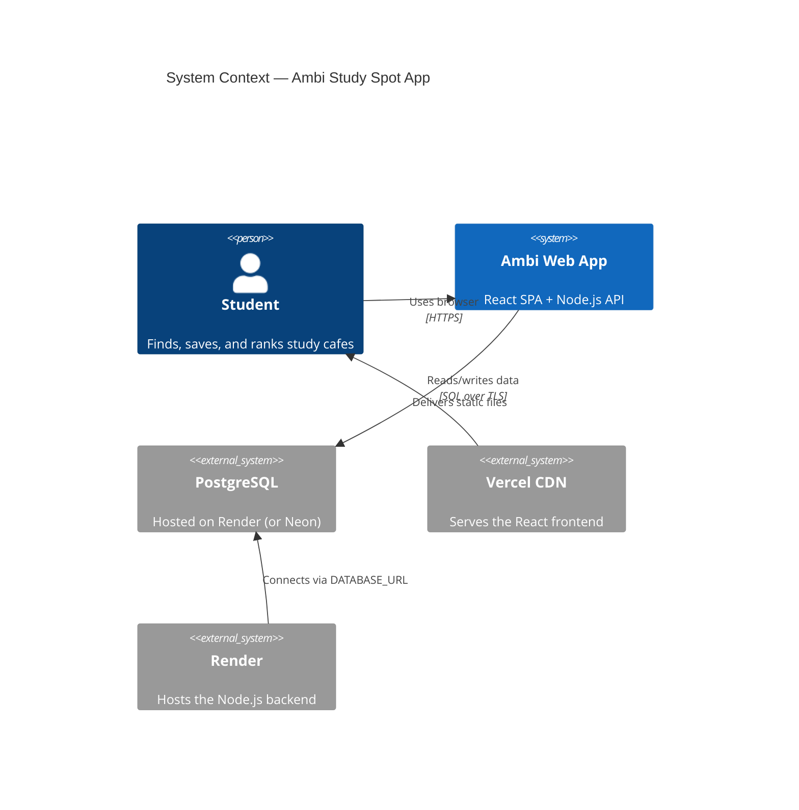
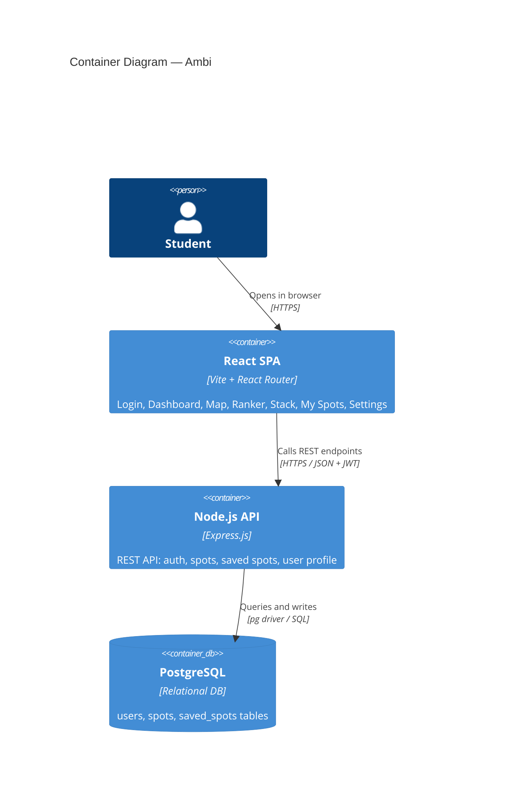
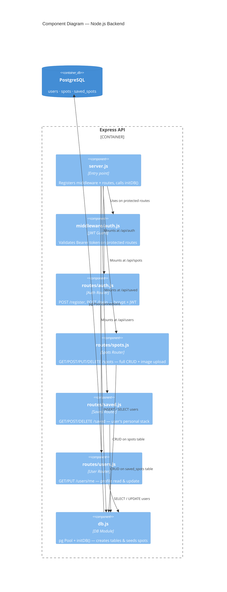
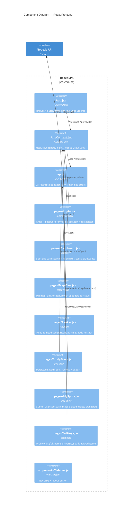

# C4 Architecture Diagrams — Ambi Full Stack

## Level 1: System Context



## Level 2: Container Diagram



## Level 3: Component Diagram — Backend



## Level 3: Component Diagram — Frontend



---

## Database Schema

```
┌──────────────┐       ┌──────────────┐       ┌──────────────────┐
│    users     │       │    spots     │       │   saved_spots    │
├──────────────┤       ├──────────────┤       ├──────────────────┤
│ id (PK)      │──┐    │ id (PK)      │──┐    │ id (PK)          │
│ email        │  │    │ name         │  │    │ user_id (FK)     │──► users.id
│ password     │  │    │ location     │  └───►│ spot_id (FK)     │──► spots.id
│ full_name    │  └───►│ created_by   │       │ user_score       │
│ university   │       │ score        │       │ created_at       │
│ created_at   │       │ noise        │       └──────────────────┘
└──────────────┘       │ wifi         │
                       │ parking      │
                       │ image_url    │
                       │ lat / lng    │
                       │ is_default   │
                       │ created_at   │
                       └──────────────┘
```
